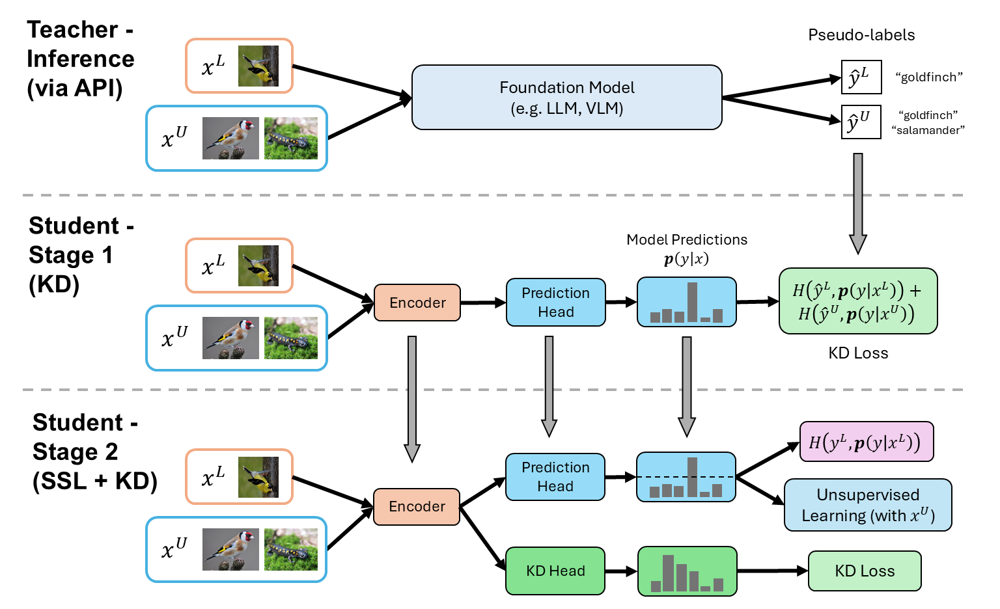

# ZeroMatch: Enhancing Semi-supervised Learning with Zero-shot Pseudolabels

This repository contains the code to reproduce the experimental results from the ZeroMatch paper: ["Enhancing Semi-supervised Learning with Zero-shot Pseudolabels" (TMLR 12/2025)](https://openreview.net/forum?id=WB05Doi29V).  
The paper explores merging the capabilities of semi-supervised learning algorithms (e.g., AdaMatch) with knowledge distillation of zero-shot pseudo-labels from foundation models (e.g., GPT-4o, GPT-4.1, and Llama3.3-70B).  
ZeroMatch trains a compact student model and accesses foundation models only through inference services, making it suitable for low-resource environments such as personal devices with limited compute.

This codebase is built on top of [USB](https://github.com/microsoft/Semi-supervised-learning) and [GRIP](https://github.com/BatsResearch/menghini-neurips23-code).

## Instructions

1. To reproduce ZeroMatch training results, please follow the instructions in the [train_zeromatch directory](./train_zeromatch/README.md). Note that the datasets we provide already include zero-shot pseudo-labels generated from foundation models, so you do not have to generate them yourself.

2. To explore the code for generating zero-shot pseudo-labels for different datasets, please see the [get_zero_shot_plabels directory](./get_zero_shot_plabels/README.md).

<!-- ## Citation

If you find this work helpful, please consider citing the following paper:

@inproceedings{

} -->
